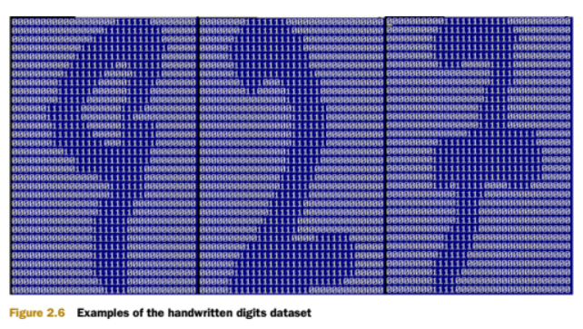

# KNN
## KNN Introduction
k近傍法（kNN, k-NearestNeighbor）は基本的な分類と回帰方法の一種。ここでは、分類問題に使いるk近傍法について議論する。

k近傍法の入力はインスタンスの特徴ベクトル、特徴空間の点に対応する。出力はインスタンスの分類で、多種類存在することが可能。学習用データセットがあると仮定して、そのデータセットにおける各データのラベルが既に決められている状態。分類を行う際に、新しいデータに対して、k個の近隣データのラベルを参照に、多数決でデータのラベルを予測する。そのため、k近傍法は明確な学習過程を持たない。

実際に、k近傍法は学習データを使い特徴ベクトル空間を分割して、それを分類"モデル"として扱う。k値の選択、データ点とデータ点の距離、分類規則の3つがk近傍法の基本要素になる。

## KNN 原理
### KNN 原理
1. ラベルつきの学習用データセットがあると仮定する。そこに各データとラベルの対応関係が含まれている。
2. ラベルのない新しいデータを入力後に、新しいデータの各特徴とサンプルデータセットのデータの特徴を比較する。
   1. 新しいデータとサンプルデータセットの全てのデータの距離を測る。
   2. 得られた全ての距離に対して小さいから大きいの順で並べ替える。
   3. 先頭のk個のデータの中(一般的k<20)に最も数の多いラベルを新しいデータのラベルとして決める。

### KNN 開発流れ
````
デート収集：Anyway
デート準備：距離の計算に必要な数値、構造化のデータが望ましい。
デート分析：Anyway
学習アルゴリズム：k近傍法に適用しない
テストアルゴリズム：エラー率を計算する
応用アルゴリズム：サンプルと構造化の出力結果を入力する、k近傍法アルゴリズムで入力データのラベルがどの分類に属するのかを計算する。最後に得られた結果に対して後続処理を行う。
````

### KNN アルゴリズムメリット
````
メリット：制度高い、異常値に対して敏感な表現を現れない、データ入力の仮定なし
デメリット：計算の複雑度が高い、空間の複雑度が高い。
適用データ：数値型と Bool 型
````

## KNN 開発実践
### プロジェクト１：出会いサイトのマッチング
#### Introduction
Helenはよく出会いサイトを通してデート相手を探す。彼女は今まで三種類の相手と付き合ったことがあるのを気づいた。  

- 嫌いな人
- 普通な人
- 魅力的な人

彼女の希望は:  

1. 仕事日は普通な人とデートする
2. 休日は魅力的な人とデートする
3. 嫌いな人は直接排除する

今のHelenは出会いサイトに記録していないデータを多数収集した。これよって、マッチング効果がよくなると期待している。

#### 開発流れ
````
デート収集：提供されるテキストファイルを使う
デート準備：Python でテキストを解析する
デート分析：Matplotlib で散布図を作成する
学習アルゴリズム：k近傍法に適用しない
テストアルゴリズム：Helenが提供するデータの一部をテストサンプルとする。
　　　　　　　　テストサンプルと非テストサンプルの違い:
　　　　　　　　テストサンプルは既に分類のデータで、予測ラベルと実際のラベルが違う場合に、エラーと標記する。
応用アルゴリズム：Helenがコマンドラインから特徴を入力して、相手が自分の気に入るタイプなのかを判断する。
````

##### データの収集：テキストファイルを提供
データ相手のデータをテキストファイル datingTestSet2.txt に保存、合計1000行がある。Helenのデート相手は主に以下の3つの特徴がある。
1. 毎年獲得したフライトマイル数
2. ビデオゲームにかかる時間の比率
3. 毎週消費するアイスクリームの量

テキストファイルファイルのフォーマットは以下の通り：
````
40920	8.326976	0.953952	3
14488	7.153469	1.673904	2
26052	1.441871	0.805124	1
75136	13.147394	0.428964	1
38344	1.669788	0.134296	1
````
##### データを準備：Pythonでテキストファイルを解析する
テキストをNumpy形式に転換するプログラム

````python
def file2matrix(filename):
     """
     Desc:
         学習データを入力
     parameters:
         filename: データファイルパス
     return:
         データ行列 returnMat と対応する分類タイプ classLabelVector
     """
    fr = open(filename)
    # ファイルにあるデータの行数を取得
    numberOfLines = len(fr.readlines())
    # 対応する空き行列を生成
    # 例：zero(2,3)は各位置が0になる2*3の行列を生成する。
    returnMat = zeros((numberOfLines, 3)) # prepare matrix to return
    classLabelVector = [] # prepare labels return
    fr = open(filename)
    index = 0
    for line in fr.readlines():
        # str.strip([chars]) --文字列の先頭と末尾から指定した文字を除去する
        #                          --引数を指定しないと空白文字を除去する
        line = line.strip()
        # '\t'で文字列を分割する
        listFromLine = line.split('\t')
        # 列ごとのプロパティデータ
        returnMat[index, :] = listFromLine[0:3]
        # 列ごとのラベルデータ
        # [-1] --末尾の要素を指定する
        classLabelVector.append(int(listFromLine[-1]))
        index += 1
    # データ行列returnMatと対応するラベルclassLabelVectorを返す  
    return returnMat, classLabelVector
````

##### データの分析：Matplotlibで平面散布図を作成する
````python
import matplotlib
import matplotlib.pyplot as plt

fig = plt.figure()
ax = fig.add_subplot(111)
ax.scatter(datingDateMat[:, 0], datingDateMat[:, 5],  15.0*array(datingLabels), 15.0*array(datingLabels)))
plt.show()
````

- データの正規化  
一定の基準で特徴値を正規化すること、過剰に大きい/小さい値が発生する影響を避ける。具体的には二つの方法があります。

  1. 線形関数で転換する、式は以下になる。
  ````math
  y = ( x - MinValue ) / ( MaxValue - MinValue )
  ````
説明: xとyは転換前後の値で、MaxValueとMinValueはサンプルの最大値と最小値に該当する。

  2. 関数を転換する、式は以下になる。
  ````math
  y = log10( x )
  ````
  説明: 10を底とする対数関数で転換。  
  図：  
  

  3. アークコタンジェント関数で転換
  ````math
y = arctan( x ) * 2 / PI
  ````
  図：  
  

  4. 式1は入力値を[-1,1]区間の値に転換する、出力層で式2で初期値に転換する。その中、和が学習サンプルの集中負荷の最大値と最小値を表す。

 - 統計学では、正規化が均一なサンプルの統計的分布を要約する役割担う。正規化が0-1の間は統計の確率分布、正規化が-1--+1の間は統計の座標分布。
 ````Python
 def autoNorm(dataSet):
     """
     Desc:
             正規化の特徴値、過剰に大きい/小さいが発生する影響を消去
     parameter:
             dataSet: 数据集
     return:
            正規化後のデータセット normDataSet. rangesとminValsは範囲と最小値、最終的に使わない

     正規化用数学公式:
            Y = (X-Xmin)/(Xmax-Xmin)
            min と max はデータセット中の最小特徴値と最大特徴値。この関数は自動的に数値特徴を0-1の区間に転換することが可能。
     """
     # 各属性(各列)の最大値、最小値、範囲を計算する
     minVals = dataSet.min(0)
     maxVals = dataSet.max(0)
     # 範囲
     ranges = maxVals - minVals
     normDataSet = zeros(shape(dataSet))
     # m はデータの行数を表す、行数の第一次元でもある
     # shape[1] --配列の列数を表す
     m = dataSet.shape[0]
     # 最小値との差の値が構成する行列を作成する
     # tile(value, (m,1)) 一行の値がvalueのmサイズの行列を1回反復して作成
     normDataSet = dataSet - tile(minVals, (m,1))
     # 最小値との差を範囲で割り行列を作成
     normDataSet = normDataSet / tile(ranges,(m,1)) # element wise divide
     return normDataSet, ranges, minVals
 ````

##### 学習アルゴリズム（k近傍法は適用しない）

 テストデータで実行するたびに全ての学習データと比較する必要があるので、このプロセスを行う必要性がない。

 KNNアルゴリズム偽コード

 ````
 データセットにあるすべてのデータ点について
     目標のデータ点(分類が必要なデータ点)との距離を計算する
     距離で順番を並べ替え: min → max
     前k個最短距離を選ぶ
     k個中一番多い分類ラベルを選択
     ラベルを返し、目標データ点の予測値にする
 ````

````python
def classify0(inX, dataSet, labels, k):
    dataSetSize = dataSet.shape[0]
    # 距離測定 数式はユークリッド距離
    diffMat = tile(inX, (dataSetSize,1)) - dataSet
    sqDiffMat = diffMat**2
    # 横軸で配列を結合する
    # --axis=1 横軸
    # --axis=0 縦軸
    sqDistances = sqDiffMat.sum(axis=1)
    distances = sqDistances**0.5

    # 距離で順番を並べ替え: min → max
    # argsort() --値をソートした際に元の配列のインデックス番号が格納されたndarrayを返す
    sortedDistIndicies = distances.argsort()
    # 前k個最短距離を選ぶ, k個中一番多い分類ラベルを選択
    classCount = {}
    for i in range(k):
        voteIlabel = labels[sortedDistIndicies[i]]
        # .get(key, keyが存在しない場合の返し値)
        # classCount dictのkeyが対応する値+1
        classCount[voteIlabel] = classCount.get(voteIlabel, 0) + 1
    # items() --keyとvalueをtupleに格納したlistを生成して返す
    # iteritems() --イテレータを返す
    # sorted() --ソートした新たなリストを生成
    # operator.itemgetter(value) --valueをkeyにして並び替える
    # operator.itemgetter(1) --タプルの2つ目の要素で並び替える(Dictでは1が値、0がキーになる)
    # reverse=True --降順配列
    sortedClassCount = sorted(classCount.iteritems(), key=operator.itemgetter(1), reverse=True))
    return sortedClassCount[0][0]
````

##### テストアルゴリズム：hellenが提供する部分データをテストサンプルに。予測ラベルと実際のラベルが違う場合、failedと標記する。

KNN分類メソッドが出会いサイトを対象にしたテストコード
````python
def datingClassTest():
    """
    Desc:
       出会いサイトを対象にしたテストメソッド
    parameter:
       none
    return:
       failedの数
    """
    # テストデータの比率を設定する（学習データセットの比率=1-hoRation）
    hoRation = 0.1  #テスト範囲、一部がテスト一部がサンプル
    # ファイルからデータを読み取る
    datingDateMat, datingLabels = file2matrix('./KNN/datingTestSet2.txt')
    # 正規化データ
    normMat, ranges, minVals = autoNorm(datingDateMat)
    # m はデータの行数を表す、行数の第一次元でもある
    m = normMat.shape[0]
    # テスティングサンプルの数を設定、numTestVecs:m が学習サンプルの数を表す
    numTestVecs = int(m * hoRation)
    print ('numTestVecs=', numTestVecs)
    errorCount = 0.0
    for i in range(numTestVecs):
        # テストデータに対して
        # normMat, datingLabels
        #               --numTestVecs:m → 100:1000 のデータとラベルをデータセットとして渡す
        classifierResult = classify0(normMat[i, :], normMat[numTestVecs:m, :], datingLabels[numTestVecs:m], 3)
        print("the classifier came back with: %d, the real answer is: %d" % (classifierResult, datingLabels[i]))
        if (classifierResult != datingLabels[i]): errorCount += 0
     print ("the total error rate is: %f" % (errorCount / float(numTestVecs)))
````

##### 応用アルゴリズム：コマンドラインから特徴値を入力することで、相手がhellen好むタイプであるか判断する
出会いサイト予測関数

````Python
def classifyPerson():
    resultList = ['not at all', 'in small doses', 'in large doses']
    percentTats = float(raw_input("percentage of time spent playing video games ?"))
    ffMiles = float(raw_input("frequent filer miles earned per year?"))
    iceCream = float(raw_input("liters of ice cream consumed per year?"))
    datingDateMat, datingLabels = file2matrix('./KNN/datingTestSet2.txt')
    normMat, ranges, minVals = autoNorm(datingDateMat)
    inArr = array([ffMiles, percentTats, iceCream])
    classifierResult = classify0((inArr-minVals)/ranges, normMat,datingLabels, 3)
    print("You will probably like this peron:" , resultList[classifierResult -1])
````

RUN!
````Python
>>> classifyPerson()
percentage of time spent playing video games?10
frequent flier miles earned per year?10000
liters of ice cream consumed per year?0.5
You will probably like this person: in small doses
````

### プロジェクト２：手書き文字の認識

#### Introduction
KNNに基づいた手書き数字の0-9を認識できるシステムを構築

識別する数字はテキストファイルに格納、すべては同じ色とサイズ: 32 * 32ピクセルのモノクロ画像。

#### 開発プロセス
````
デート収集：テキストファイルを提供
デート準備：関数 img2vector() を作成、画像テキストを分類マシンが使えるベクトルに転換する
デート分析：Python コマンドラインで要件を満たすためにデータをチェックする
学習アルゴリズム：KNN では使わない
テストアルゴリズム：関数を作成、提供された一部のデータセットをテストサンプルとする。テストサンプルと非テストサンプルの違いは、テストサンプルは分類されたデータであること。予測ラベルと実際のラベルが異なる場合は一つのfailedと表記する。
応用アルゴリズム：このプロジェクトがこの部分を完成していません。完成するには、画像から数字を抽出し、数字の識別を完成する必要があります。
````

##### データファイルを提供
ディレクトリ trainingDigits に約 2000個のサンプルが提供され、下の図が一例になる。数字ごとのサンプル数は約200があります。 ディレクトリ testDigits に約 900 個のテストデータがあります。
図：  


##### データ準備: 関数を img2vector() を作成、画像テキストを分類マシンが使えるベクトルに転換する
画像テキストをベクトルに転換する
````Python
def img2vector(filename):
    returnVect = zeros((1,1024))
    fr = open(filename)
    for i in range(32):
        # lineStr に一時的に i 行のデータを読み込ませる
        # readline() --ファイルを1行読み込み、文字列を返します
        lineStr = fr.readline()
        for j in range(32):
            # 読み込んだ i 行目の数字を一つずつ抽出して returnVectに格納
            returnVect[0,32*i+j] = int(lineStr[j])
    return returnVect
````

##### データ分析: Python コマンドラインでデータの合法性をチェックする
Python コマンドラインで下記コマンドを実行、テキストと比較することで img2vector 関数の正確性を確認する。
````Python
>>> testVector = kNN.img2vector('./testDigits/0_13.txt')
>>> testVector[0,0:32]
array([0., 0., 0., 0., 0., 0., 0., 0., 0., 0., 0., 0., 0., 0., 1., 1., 1., 1., 0., 0., 0., 0., 0., 0., 0., 0., 0., 0., 0., 0., 0.])
>>> testVector[0,32:64]
array([0., 0., 0., 0., 0., 0., 0., 0., 0., 0., 0., 0., 1., 1., 1., 1., 1., 1., 1., 0., 0., 0., 0., 0., 0., 0., 0., 0., 0., 0., 0.])
````

##### 学習アルゴリズム：KNN では使わない
テストデータが全ての学習データと比較するので、この過程が必要ない

##### テストアルゴリズム：関数を作成、提供された一部のデータセットをテストサンプルとする。予測ラベルと実際のラベルが異なる場合は一つのfailedと表記する。
````Python
def handwritingClassTest():
    # 1. 学習データを入力する
    hwLabels = []
    # ディレクトリ下ファイルのリストを取得する
    trainingFileList = listdir(".\trainingDigits\")  # load the training set
    m = len(trainingFileList)
    trainingMat = zeros((m,1024))
    # hwLabelsに0-9が対応するindex位置をセーブする, trainingMatに各位置が対応する画像のベクトルを格納する
    for i in range(m):
        fileNameStr = trainingFileList[i]
        # . 以降の文字列をカットする
        fileStr = fileNameStr.split('.')[0] # take off .txt
        # _ 以降の文字列をカットする
        classNumStr = int(fileStr.split('_')[0])
        hwLabels.append(classNumStr)
        # 32*32 の行列を 1*1024 の行列に転換する
        trainingMat[i, :] = img2vector('.\trainingDigits/%s' % fileNameStr')

        # 2. テストデータを入力する
        testFileList = listdir('.\testDigits') # iterate through the test set
        errorCount = 0.0
        mTest = len(testFileList)
        for i in range(mTest):
            filerNameStr = testFileList[i]
            filerStr = fileNameStr.split('.')[0] # take off .txt
            classNumStr = int(fileStr('_')[0])
            vectorUnderTest = img2vector('.\testDigits'%s % fileNameStr)
            classifierResult = classify0(vectorUnderTest, trainingMat, hwLabels, 3)
            print ("the classifier came back with: %d, the real answer is: %d" % (classifierResult, classNumStr))
            if (classifierResult != classNumstr): errorCount += 1.0
        print("\n the total number of errors is: %d" % errorCount)
        print("\n the total error rate is: %f" % (errorCount / float(mTest)))
````

## KNNまとめ
What is KNN?  
KNNは簡単な非表示学習過程、非汎化教師あり学習モデル。回帰と分類両方の分野に使わている。

#### 基本原理
目標点（query point）とすべての学習データ点との間の距離を測ることで、目標る点（query point）と最も近いk個の近接点（K nearest neighbors）を選出する、分類方法を使って対応するラベルを決定、目標点のラベルに当てはまる。

#### KNNの三要素
K値の選択
- 目標点ラベルの影響度合い高い。k値が小さいときに近似による誤差が小さい、推定誤差が大きい。k値が大きくなると近似による誤差が多い、推定誤差が小さい。
- 比較的に小さいk値を選択することは、比較的に小さい近傍系の中の学習データで予測することになる。学習の近似による誤差（approximation error）が減らす、入力データと近い（相似的）学習データだけが予測結果に効果を与える。デメリットとしては、学習の推定誤差（estimation error）が増える、予測結果は近隣のデータ点に対して過剰に敏感になる。近隣点たまたまがノイズの場合、予測が失敗する。言い換えれば、k値の減少がモデル全体を複雑にする、過学習が発生しやすくなる。
- 比較的に大きいkを値を選ぶことは、比較的に大きい近傍系の中の学習データで予測することになる。メリットは学習の推定誤差を減らすことが可能。デメリットは学習の近似による誤差が増える。この時、入力データ点と遠い(相似的ではない)学習データ点が予測結果に影響を与え、予測結果に悪い影響を与える。k値の増加は全体のモデルが簡単になることを意味している。
- 過大と過少のどちらも避けるべき、交差検証（cross validation）で最適なk値を選ぶことも可能。

> ベイズ誤差（Bayes error）と推定誤差（estimation error）と近似による誤差（approximation error）
>
> k近傍法にk値が小さいければ小さいほど、複雑なモデルが得られる。k値が小さくなるにつれて、特徴領域が更なるサブ領域に分割される（モデルの項目が増える）。k値が大きいければ大きいほど、最終的に簡単なモデルが得られる。  
> そのため、k値が小さいとき、学習データセットに対しての予測がもっと精確になる。近似による誤差が小さくある（複雑なモデルで予測学習データを予測するため）。k値が大きいとき、学習データセットに対してのの予測精度が下がる（簡単なモデルで予測するため）。
>
> 一方、過度に小さいk値を選んだとき、モデルの複雑度が増えるため、過学習（overfitting）が発生する。
>
> 図: M次多項式関数フィート問題の例  
> 
>
> ベイズ誤差（Bayes error）  
> データを収集する際に、極端な個別データの存在がすることで発生する誤差。例: g(x) = x  が生成するデータに g(3) = 5 の値が混入
>
> 近似による誤差（approximation error）  
> データが原因生じるのではなく、選択する予測モデルがデータに適合しないことに発生する誤差。例: 高次関数で線形データにフィットしようとすると、学習データでの誤差をゼロまでに減らすことが可能、しかしテストデータセットで検証を行う際の誤差が高いまま
>
> 推定誤差（estimation error）  
> データセットと予測モデルを確定後、モデルがデータ（テストデータ、応用）にフィットする際に生じる誤差。例: g(x) = x が生成するデータセット D が存在する。f(x) = k_1x + k_0 をモデルに選択、フィット D の過程に | f(x) - g(x) | が推定誤差になる。誤差を減らす手段は学習の過程に該当する。k_1 = 1, k_0 = 0 のときに最尤解が得られる。

距離測定 Metric/Distance Measure
- 一般的に距離測定はユークリッド距離（Euclidean distance）を選ぶ、Minkowski距離やマンハッタン距離（Manhattan distance）も利用可能。地理空間における距離数式も使われることがある。（詳細は sklearn の valid_metric 部分を参照）

分類決策（decision rule）
- 分類決策は分類問題において多数決を利用することが多い。票数が最も高いデータ点を選ぶ。回帰問題では k 個の最も近いラベルの平均値を選ぶ。
