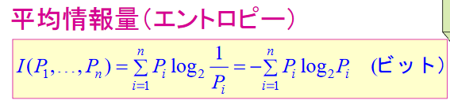
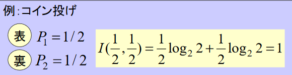
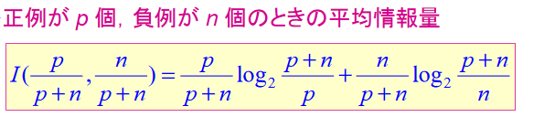
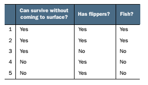
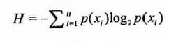

# 決定木
## 決定木 Introduction
決定木（Decision Tree）は分類と回帰方法の一種で、データマイニングでの領域でよく使われたアルゴリズムである。ここでは分類に使う決定木を議論する。

決定木モデルは木の形をする。分類問題では、特徴に基づいてインスタンスの分類を行う過程を表す。決定木を if-then ルールの集合として認識することが可能で、特徴空間と分類空間に定義された条件付き確率分布として認識することも可能である。

決定木のアルゴリズムは通常３つのステップがある: 特徴選択、決定木の生成、決定木の剪定。

## 決定木の定義

分類用の決定木モデルはデータに対して分類を行う木型構造を指す。決定木はノードと有向辺（directed edge）で構成される。ノードは二種類がある、内部ノード（internal node）と葉ノード（leaf node）。内部ノードは一つの特徴あるいは属性（features）を表す、葉ノードは一つの分類を表す（labels）。

決定木を使いテストするためのデータを分類する場合、根ノードから、データのある特徴に対してテストを行い、その結果を参照に、データをその子ノードに渡す; この時、それぞれの子ノードがこの特徴に対応する結果値になる。このように再帰的にデータに対してテストを行い分配を行う、葉ノードに到達するまで進行する。最終的葉ノードのラベルがデータの分類になる。

## 決定木の原理
### 必須理論
情報エントロピー & 情報利得
エントロピー （entropy）: エントロピーは体系の混乱度合いを表す概念である。学科によってもっと具体的な概念を定義することもある。多くの分野にとっては重要な参照量になる。

情報理論（information theory）でのエントロピー（シャノンエントロピー）: 情報の度量方式、情報の混乱度合いを表す。つまり、情報が規則的であるほど、情報エントロピーが低い。例: マッチが規則的にマッチ箱に収納されているとエントロピーが低い。逆に、エントロピーが高い。

情報利得（information gain）: データセットを分割する前後が情報が発生する変化は情報利得と呼ぶ。

> データがn個のクラスのどれか1つに分類できるとし、クラスiに属する確率をPiと表す。  
> 情報理論での定義によると、あるデータがクラスiに属することを知るには、最低でもlog(1/Pi)ビットの情報量が必要である(logの底は２である)。従って、そのデータをクラス1~nのいずれかに分類するに必要な情報量、その期待値を計算して、下記の式で求められる。これを平均情報量といい、I(P1,...Pn)で表す。
>  
>  
>  

### 決定木 動作原理
createBranch() で 決定木を構成する。

````python
def createBranch():
# ここでは再帰(recursion)の考え方を利用する
     データセット中すべてデータの分類ラベルが同じかどうかチェックする:
          If so return 分類ラベル
          Else:
               分類データセットを分割する最尤特徴を探す（分割後情報エントロピー最小、情報利得が最大となるもの）
               データセットを分割
               枝分かれノードを作成
                    for 分割されたデータセット
                         関数呼び出す createBranch（枝を作る関数）return結果を枝のノード中に追加
               return 枝分かれノード
````


ID3アルゴリズム
````C

S: 訓練例の集合
A: 特徴の集合
default: Yes/Noの既定値

決定木 ID3(S, A, default) {
     else if(Sがすべて正例) return Yes
     else if(Sがすべて負例) return No
     else if(Aが空集合) return 多数決(S)
     else {
              bestA = Aのうちで情報利得が最大の属性;
              tree = new 決定木(bestA);
              bestAdomain = bestA の取りうるすべての値;

              for each v in bestAdomain do {
                S' = S のうち bestA = v となっている全てデータ;
                subtree = ID3(S', A-bestA, 多数決(S))
                tree の下に subtree を v の枝で連結する;
              }
              return tree;
             }

}
````
このアルゴリズムは、入力として、訓練例の集合S、特徴の集合A、及びYes/Noのデフォルト値を受け取り、それを説明するための決定木を生成して出力する。

エントロピーの最大利得が最大の特徴bestAを選び、その属性値vごとに(本例では水面に出なくでも生存可能か否か)、ID3を再帰的に呼び出しながら決定木を成長させている。

再帰呼出しの引数は、Sの代わりにbestA=vを満たす訓練例の部分集合S'に縮小される。属性の集合AからはbestAが削除される。また、デフォルト値は、親ノードSに残っている訓練例の多数決により決定されるYesまたはNoである。

ノイズの過剰一致

過学習：一般的に、訓練例にはノイズと呼ばれる誤りの一種が含まれている。ノイズまでも再現するような細かな分類は、不適切な決定木を生み出すことが多い。これを過学習という。

決定木の剪定：枝の前述の問題を避けるための基本的な考え方は、情報エントロピーの情報利得が十分小さいときには、もうこれ以上の分類をやめて、そこを終端ノードとすることである。これを、決定木の剪定という。

決定木の剪定ための情報利得の一般的設定：個の問題は、統計的仮説検定の考え方によって解決できる。危険率5%の設定のもとで、統計的に有意性が認められない分類をしている枝を剪定する。

性能評価
1. サンプルを収集
2. それを訓練集合とテスト集合の互いに素な集合に分ける。
3. 訓練集合を学習アルゴリズムに入力して決定木を生成する。
4. テスト集合を決定木に入力して、正答率を求める。

訓練集合とテスト集合に共通部分がないように分離している点が重要である。


### 決定木 開発流れ
````
デート収集：Anyway
デート準備：木構成アルゴリズム（ここではID3アルゴリズムを使用、bool型のデータのみ適用。これが数値型データが離散的でなければならない理由。他にも木構成アルゴリズムがある、CARTなど）
デート分析：Anyway, 木構成後、図形が予想通りになのかをチェックする。
学習アルゴリズム：木を構成するデータ構造
テストアルゴリズム：計算済みの木でerror率を計算
応用アルゴリズム：このステップはすべての教師あり学習に適用する。決定木を使用することでデータの内在意義を理解しやくなる。
````

````
データの離散化  
前提仮設: 連続特徴が異なる区間での与えが結果に与える影響が違う  
連続するデータをいくつかに分割すること（0-100の成績を優、良、可、否に分ける）
````

### 決定木 アルゴリズム特徴
````
メリット：計算複雑度低い、出力結果が理解しやすい、データが欠けてもRUN可能、無関係特徴の処理が可能
デメリット：過学習になりやすい
適応データタイプ：数値型とBool型
````

## 決定木 開発実践
### プロジェクト１：魚類の判定

#### Introduction
以下２つの特徴で動物を二種類にわける: 魚類と魚類以外。

特徴:
1. 水面に出なくでも生存可能
2. 足ヒレがあるかないか

#### 開発流れ
````
デート収集：Anyway
デート準備：木構成アルゴリズム（ここではID3アルゴリズムを使うため、数値型データが離散的でなければならない）
デート分析：Anyway, 木構成後、木を書き出す。
学習アルゴリズム：木を構成する。
テストアルゴリズム：計算済みの木で分類を行う。
応用アルゴリズム：このステップはすべての教師あり学習に適用する。決定木を使用することでデータの内在意義を理解しやくなる。
````

##### データの収集


createDataSet()でデータを入力する
````python
def createDataSet():
     dataSet = [[1, 1, 'yes'],
                       [1, 1, 'yes'],
                       [1, 0, 'no'],
                       [0, 1, 'no'],
                       [0, 1, 'no']]
     labels = ['no surfacing', 'flippers']
     return dataSet, labels
````

##### デート準備：木構成アルゴリズム
入力データが離散的なデータのためこのステップ省略。

##### デート分析：Anyway, 木構成後、木を書き出す。
p( x_i ) はこの分類を選択する確率。
エントロピーを計算するために、すべての種類すべての値が含まれる情報の期待値（平均情報量）を計算する、下記の公式を使用する  [平均情報量の説明](https://logics-of-blue.com/information-theory-basic/)  

````
期待値: 確率を考慮した平均値
````

与えられたデータセットでシャノンエントロピーを計算する関数
````python
def calcShannonEnt(dataSet):
     # list の長さを求める、学習に参加するデータ量を計算
     numEntries = len(dataSet)
     # 分類ラベルlabelが出現する回数
     labelCounts = {}
     # the the number of unique elements and their occurrence
     # featVec に dataSet を一行ずつ読み込ませる [1, 1, 'yes']......[1, 1, 'yes']......
     for featVec in dataSet:
          # 現在進行中データのラベルを保存、一行最後のデータ値がラベルになる
          currentLabel = featVec[-1]
          # 全ての可能性のある分類のために辞書を作成、現在進行中のキー値が存在しないとき、辞書を拡張して現在進行中のキー値を辞書に加える。すべてのキー値が現在進行中の分類が出現回数を記録
          if currentLabel not in labelCounts.keys():
               labelCounts[currentLabel] = 0
          labelCounts[currentLabel] += 1

     # label ラベルの比率に対して、label ラベルのシャノンエントロピーを計算する
     shannonEnt = 0.0
     # labelCounts: {'yes': 2, 'no': 3}
     # key に labelCounts のキーを一つずつ読み込ませる
     for key in labelCounts:
          # ラベルの出現確率で、その分類が出現する確率を計算
          prob = float(labelCounts[key]) / numEntries
          # シャノンエントロピーを計算する、2を底とする対数を求める
          shannonEnt -= prob * math.log(prob, 2)
     return shannonEnt
````

与えられた特徴でデータセットを分割  
特定特徴の特徴値が value と等しい行の列を残り子データセットに扱う。
````python
def splitDataSet(dataSet, index, value):
     """
     Call:       
           from: chooseBestFeatureToSplit()
           入力データ: (dataSet, 特徴値の列目, 重複要素排除後の特徴値)
                            (dataSet,                    0,                                       0)
                            (dataSet,                    0,                                       1)
                            (dataSet,                    1,                                       0)
                            (dataSet,                    1,                                       1)

     splitDataSet（dataSetをトラバーサルする，[index]が対応するcolnum列の值をvalueの行にする）
     index列をベースに分類を行う、index列のデータとvalueが等しいとき、indexを新しい作ったデータセットに分類する

     Args:
          dataSet データセット                                                 分類待ちのデータセット
          index    行が対応する[index]列   sample=[[1,1]    
                       index=0(列) or 1(列)                    [1,0]]     分類データセットの特徴
          value    [index]列が対応するvalue                           特徴の値
      Returns:
          [index]列がvalueのデータセット【このデータセットはindex列を除外する必要がある】
     """
     retDataSet = []
     # dataSetの特徴部分を対象に
     for featVec in dataSet:
          # [index]列がvalueのデータセット【このデータセットはindex列を除外する必要がある】
          # [index]列の値が[value]なのか判断する
          if featVec[index] == value:
               # chop out index used for splitting
               # [:index] --前<index>行を意味する、indexが2とすれば、featVecの前<index>行を取る
               reducedFeatVec = featVec[:index]
               '''
               extendとappendの違い
               music_media.append(object) 配列に対象objectを追加
               music_media.extend(sequence) シリアルseqの内容の内容を配列に追加 ( += がlistでの使いが似ている， music_media += sequence)
               1.appendを使う際に、objectを対象として扱う、全体ををまとめてmusic_mediaに追加
               2.extendを使う際に、sequenceをシリアルとして扱う、このシリアルとmusic_mediaを合併させ、music_mediaの最後尾に置く
               music_media = []
               music_media.extend([1,2,3])
               print (music_media)
               ==>[1, 2, 3]

               music_media.append([4,5,6])
               print (music_media)
               ==>[1, 2, 3, [4, 5, 6]]

               music_media.extend([7,8,9])
               print music_media
               ==>[1, 2, 3, [4, 5, 6], 7, 8, 9]
               '''
               # [index+1:] --index の <index+1> 行を飛ばし、そのあとのデータを取る
               reducedFeatVec.extend(featVec[index+1:])
               # 結果値を収集する <index>列が<value>の行【この行はindex列を排除する必要がある】
               retDataSet.append(reducedFeatVec)
     return retDataSet
````
最尤のデータ分割方式を選ぶ
````Python
def chooseBestFeatureToSplit(dataSet):
      """chooseBestFeatureToSplit(最尤の特徴を選択)

      Args:
             dataSet データセット
      Returns:
             bestFeature 最尤の特徴列
      """
      # 一行目の Feature が何列あるのか確認する、最後の列はlabel列になる
      numFeatures = len(dataSet[0]) - 1
      # データセットの原始エントロピーを収集する
      baseEntropy = calcShannonEnt(dataSet)
      # 最尤の情報利得と最尤Featurnの番号
      bestInfoGain, baseFeature = 0.0, -1
      # iterate over all the features
      for i in range(numFeatures):
           # create a list of all the examples of this feature
           # 対応featureのすべてのデータを取得
           featList = [example [i] for example in dataSet]
           # get a set of unique value   
           # 重複するデータを解き除く
           uniqueVals = set(featList)
           # 一時的な情報エントロピーを作成
           newEntropy = 0.0
           # 各列のvalue集合を遍歴、この列の情報エントロピーを計算
           # 現在進行中の特徴値におけるすべて唯一の属性値を遍歴する、それぞれの唯一属性に対してデータセットを作成する
           for value in uniqueVals:
                subDataSet = splitDataSet(dataSet, i , value)
                # 確率の計算
                prob = len(subDataSet) / float(len(dataSet))
                # 情報エントロピー
                newEntropy += prob * clacShannonEnt(subDataSet)
           # gain[情報利得] : データ分割前後の情報変化、情報エントロピー最大値を取得
           # 情報利得はエントロピーの減少あるいはデータ無秩序の度合いを意味する。最終的に、すべての特徴値中の情報利得を比較して、最も分割しやすい索引値を返す
           infoGain = baseEntropy - newEntropy
           print("infoGain=", infoGain,"bestFeature=", i, baseEntropy, newEntropy)
           if (infoGain > bestInfoGain):
                bestInfoGain = infoGain
                bestFeature = i
      return bestFeature
````
Q: 上記コードの newEntropy はなぜ subDataSet を元に計算しているのか？
A: ある特徴に基づいてシャノンエントロピーを計算する際に、この特徴の分類値が同じになる、この特徴のシャノンエントロピーがゼロになる。そのため新しいシャノンエントロピーを計算する際にsubDataSetを使います。

木生成関数
````Python
def createTree(dataSet, labels):
      classList = [example[-1] for example in dataSet]
      # データセット最後列の最初の値が現れた回数＝データセットにおけるデータの数場合、つまりラベルが一種類しか存在しないことを意味する。その結果を返せばよい。
      # 1st 中止条件：全てのラベルが同じ、このラベルを返す
      # count() 関数は括弧中の値がlistに現れた回数を表す
      if classList.count(classList[0]) == len(classList):
           return classList[0]
      # データセットが一列のみ存在する場合、ラベル出現回数が一番多い分類を結果として扱う
      # 2nd 中止条件：全ての特徴を使い切っても、データセットを一分類のみが存在するグループにならない場合()
      if len(dataSet[0]) == 1:
           return majorityCnt(classList)

      # 最尤列を選び、最尤列が対応するラベルを取得（bestFeat: numFeaturesの第X列目）
      bestFeat = chooseBestFeatureToSplit(dataSet)
      # ラベルの名前を取得
      bestFeatLabel = labels[bestFeat]
      # myTreeを初期化する
      myTree = {bestFeatLabel: {}}
      # ! labels テーブルは可変対象、python関数中に引数として使うときアドレスを渡し、グローバルで変更可能
      # ラベルをリストから削除する
      del(labels[bestFeat])
      # 最尤特徴の列を取り出し、その枝で分類を行い
      featValues = [example[bestFeat] for example in dataSet]
      uniqueVals = set(featValues)
      for value in uniqueVals:
           # 残されたラベルを求める
           subLabels = labels[:]
           # 現在選択された特徴が含まれた全ての特徴値を再帰的に処理、すべてのデータセットを分割するときに関数createTree()を呼び出す。
           myTree[bestFeatLabel][value] = createTree(splitDataSet(dataSet, bestFeat, value), subLabels)
           # print('myTree', value, myTree)
      return myTree
````

テスト関数
````Python
def classify(inputTree, featLabels, testVec):
      """classify(入力された節点を与え、分類を行う)

      Args:
          inputTree  決定木モデル
          featLabels Featureラベルが対応する名前
          testVec      入力データをテストする

      Returns:
          classLabel  分類の結果値、labelと照合して名前を確認する
      """
      # treeの根節点が対応するキー値
      firstStr = list(inputTree.keys())[0]
      # キーを通して根節点が対応するvaluleを得る
      secondDict = inputTree[firstStr]
      # 根節点の名前で根節点がlabel内の前後順番を取得、これで入力されたtestVecがどうやって木を参照に分類を行うことがわかる
      featIndex = featLabels.index(firstStr)
      # データのテストを行う、根節点が対応するlabel位置を探す、これで、入力データの第何位から分類することがわかる
      key = testVec[featIndex]
      valueOfFeat = secondDict[key]
      print('+++', firstStr, 'xxx', secondDict, '---', key, '>>>', valueOfFeat)
      # 枝分かれの終了を判断、valueOfFeatがdict型なのかを判断
      if isinstance(valueOfFeat, dict):
           classLabel = classify(valueOfFeat, featLabels, testVec)
      else:
           classLabel = valueOfFeat
      return classLabel

def fishTest():
      #  データとラベルを作成
      myDat, labels = createDataSet()
      # print myDat, labels

      # label分類のシャノンエントロピーを計算
      # calcShannonEnt(myDat)

      # 0列目の 1/0の列のデータセットを求める
      # print '1---', splitDataSet(myDat, 0, 1)
      # print '0---', splitDataSet(myDat, 0, 0)

      # print chooseBestFeatureToSplit(myDat)

      import copy
      myTree = createTree(myDat, copy.deepcopy(labels))
      print(myTree)
      # [1, 1]は取る予定の枝上の節点位置を意味する、結果値に対応する
      print(classify(myTree, labels, [1, 1]))

      # 木の高さを求める
      # print(get_tree_height(myTree))

      # 木を描く
      dtPlot.createPlot(myTree)
````
#####エントロピーについて  

木の生成及び枝分かれを決めるには識別力の高い特徴で木を構成する必要がある。

原始データのエントロピーを計算する。この値は、最終的にYes/Noの区別をつけるために必要な情報量の期待値。この例ではyesの例が2個、noの例が3個なので、エントロピー=0.97ビットになる。この全訓練例を表すノードを生成して、それを決定木の根ノードとする。

そして、ある属性(例えば水面に出なくでも生存可能)をテストして、その結果に応じて、訓練例を2つ(0と1)に分割して、2つの個ノードを生成して、決定木の一部を作り出す。それぞれのエントロピーを求めると、それぞれ0.0と0.550978となる。

任意の質問が与えられたときには、訓練例はこの2分割のうちのいずれか1つに縮小させる。その確率は、それぞれ、水面に出なくでも生存可能=はい、いいえ であるが、これを訓練例から推定すると、0.4、0.6(def chooseBestFeatureToSplitのprob計算部分)である。従って、この属性(水面に出なくでも生存可能)についてテスト後の平均情報量は0.550978になる(newEntropy)、識別には、平均してあと0.550978ビット必要ということ。

従って、識別に必要な情報量は、この特徴でテストする前の0.97からテスト後の0.550978へ、0.4199ビットが減少したことが分かる。これが、属性「水面に出なくでも生存可能」テストによって得られる情報の利得(information gain)である。そして、これが属性「水面に出なくでも生存可能」の識別力であると考えるのである。

同様に、「水面に出なくでも生存可能」属性以外の属性についても情報利得を計算する。

そこで、これらの中で、最大情報利得が得られる属性を決定木のねとして採用する。その結果は、「水面に出なくでも生存可能」を根とするような部分的な決定木となる。

「水面に出なくでも生存可能」によって、訓練例が二つに分割されている。そのそれぞれについて、これまでの考え方を再帰的に適用して、ここからしたの部分の決定木を生成すしていけばよい。他の特徴のそれぞれについて、また情報利得計算する。

例外的に発生するケースについて、すべての属性を調べても、魚類かどうかは訓練例から確認できない、これは誤りというより、調べるべき属性が足りないことによる情報不足で、ノイズとも呼ばれている。このように、すべての属性をテストしても正負の例が混在する場合には、残っている訓練例の多数決でYes/Noに決める。

木生成サンプル
````python
createTree()
    ==> Progress1: createTree(dataSet, {no surfacing, flippers})
    ==> Progress2: 最尤列(0列目)と特徴(0個目)一つを選び出す： 0 and "no surfacing"
    ==> Progress3: 木を初期化する： {'no surfacing': {}}
    ==> Progress4: すでに選択された特徴を木をリストから削除する：List=['flippers']
    ==> Progress5: 木の特徴が対応する列を抜き出し、分類を行う："no surfacing" [1, 1, 1, 0, 0]
    ==> Progress6: 抜き出した列の重複値を取り除く： [1, 0]
    for value in [0,1]:
        ==> Loop1: Progress7: 残されたラベルを求める：['flippers']
        ==>             Progress8: myTreeの[no surfacing]の[0]番目キーにcreateTree(特徴'no surfacing'で分割されたdataSet=[[1, 'no'], [1, 'no']], {flippers})
        ==>             Progress9: データセットのラベル:  ['no', 'no']
        ==>             Progress10: 最尤列(0列目)と特徴(0個目)一つを選び出す： 0 and "flippers"(データセットが一列のみ存在する)
        ==>             Progress11: majorityCnt(classList)
        ==>             Progress12: myTree 0 {'no surfacing': {0: 'no'}}
        ==> Loop2: Progress13: 残されたラベルを求める：['flippers']
        ==>             Progress14: myTreeの[no surfacing]の[1]番目キーにcreateTree(特徴'no surfacing'で分割されたdataSet=[[1, 'yes'], [1, 'yes'], [0, 'no']], {flippers})
        ==>             Progress15: データセットのラベル:  ['yes', 'yes', 'no']
        ==>             Progress16: 最尤列(0列目)と特徴(0個目)一つを選び出す： 0 and "flippers"
        ==>             Progress17: すでに選択された特徴を木をリストから削除する：List=['']
        ==>             Progress18: 木の特徴が対応する列を抜き出し、分類を行う："flippers" [1, 1, 0]
        ==>             Progress19: 抜き出した列の重複値を取り除く： [1, 0]
        ==> SubLoop1：Progress20: 残されたラベルを求める：['']
        ==>                     Progress21: myTreeの[flippers]の[0]番目キーにcreateTree(特徴'flippers'で分割されたdataSet=[['no']], {})
        ==>                     Progress22: データセットのラベル:  ['no']
        ==>                     Progress23: myTree 0 {'flippers': {0: 'no'}}
        ==> SubLoop2：Progress24: 残されたラベルを求める：['']
        ==>                     Progress25: myTreeの[flippers]の[1]番目キーにcreateTree(特徴'flippers'で分割されたdataSet=[['yes'], ['yes']], {})
        ==>                     Progress26: データセットのラベル:  ['yes', 'yes'] (データセットが一列のみ存在する)
        ==>                     Progress27: majorityCnt(classList)
        ==>                     Progress28: myTree 1 {'flippers': {0: 'no', 1: 'yes'}}
        ==> Loop2:  Progress29: myTree 1 {'no surfacing': {0: 'no', 1: {'flippers': {0: 'no', 1: 'yes'}}}}
````

Pythonのリスト要素を抽出するサンプル
````python
for out1 in dataSet:
    ==> Loop1: 1番目の要素[1, 1, yes]
    ==> Loop2: 2番目の要素[0, 1, no]
    ==> ......Loop5
    for out2 in out1:
        ==> SubLoop1: out1の1番目の要素に対しての1番目の要素[1]
        ==> SubLoop2: out1の1番目の要素に対しての2番目の要素[1]
        ==> SubLoop3: out1の1番目の要素に対しての3番目の要素[yes]
        ==> SubLoop4: out1の2番目の要素に対しての1番目の要素[0]
        ==> ......SubLoop15
        一番目の要素[1, 1, yes]
````
