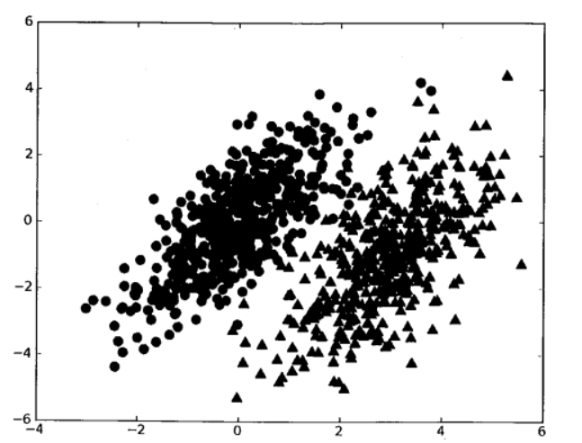
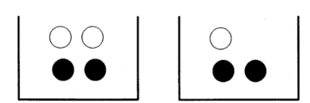
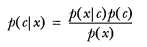

# 確率論に基づいた分類方法単純ベイズ分類器
## 単純ベイズ分類器 Introduction
ベイズ分類は、一部の分類アルゴリズムの総称で、これらのアルゴリズムはベイズ理論を基礎にするためベイズ分類と呼ばれている。

## ベイズ理論 & 条件付き確率
### ベイズ理論
データセットを一つ仮定して、二種類のデータでそのデータセットを構成する。  
  
2パラメータ既知の確率分布、パラメータが分布の形を決める。  

p1(x,y)を使い、データ点(x,y)が分類1（図の●）に所属する確率を表す。p2(x,y)を使い、データ点(x,y)が分類2（図の▲）に所属する確率を表す。新しいデータ点(x,y)に対して、下記のルールでその分類を判断する:
- p1(x,y) > p2(x,y) であれば、分類1に該当する
- p2(x,y) > p1(x,y) であれば、分類2に該当する
つまり、高い確率が対応する分類を選ぶというのはベイズ決定理論のコアの考え方。すなわち、確率が最も高い決定を選ぶ。

### 条件付き確率
p(x,y|c1)記号をよく知っている場合、以下の内容をスキップしても構わない。

小石7つが入っている容器、3つが白で4つが黒。容器からランダムに一つ石を取り出して、白い石になる確率は？石を取り出すには7つの可能性があるため、3つが白、そのため白い石を取り出す確率は3/7になる。白い石になる確率は4/7。P(white)で白い石を取れる確率、確率の値は白い石の数/石の数になる。
    
では、7つの石が下記の状態の場合、二つの容器に分けると確率の計算どうなるだろう。  
    
 P(white) や P(black)について計算する。石が置かれたの容器についての情報を事前に知れば、結果を変えることが可能。これを条件付き確率（conditional probablity）と言う。例えば、B容器から白い石を取る確率を計算する、この確率をP(white|bucketB) と書く。既知石がB容器から取り出す、それが白い石である確率と呼ぶ。P(white|bucketA)が2/4で、P(white|bucketB) が 1/3 。   

条件付き確率の公式:
 ````math
 P(white|bucketB) = P(white and bucketB) / P(bucketB)
 ````

まず、2つの容器にある石の合計をB容器の白い石の数で割り、 P(white and bucketB) = 1/7になる。B容器の石が3つで、合計の石数は7、P(bucketB)が3/7になる。 P(white|bucketB) = P(white and bucketB) / P(bucketB) = (1/7) / (3/7) = 1/3 になる。

もう一つ条件付き確率を計算する方法をベイズの定理と呼ぶ。ベイズの定理が条件付き確率の中の条件と結果を交換する方法を提供してくれた。つまり、 P(x|c)を知り、P(c|x)を求めたいときは以下の方法を使うことが可能。  
    

### 条件付き確率で分類する

前文では、ベイズ決定理論（Bayes Decision Rule）はp1(x, y) と p2(x, y)の計算を求めることに言及した:
- p1(x,y) > p2(x,y) であれば、分類1に該当する
- p2(x,y) > p1(x,y) であれば、分類2に該当する
これはベイズ決定理論の全部ではない。p1() と p2()の使用は、出来るだけ記述を簡略化するためのもので、実際に計算と比較するのはp(c1|x, y) と p(c2|x, y)である。これらの記号が表す意味は: x, yで表示するデータを与え、このデータ点は分類c1に由来する確率？このデータ点は分類c2に由来する確率？気をつける必要があるのはこれらの確率と確率p(x, y|c1)は異なるもので、ベイズの定理を使えば、確率の中の条件と結果を交換することが可能になる。ベイズの定理により下記の式が得られる。　


さらに、ベイズ決定理論を定義する
- P(c1|x, y) > P(c2|x, y), であれば、分類c1に該当する
- P(c2|x, y) > P(c1|x, y), であれば、分類c2に該当する

ドキュメントの分類において、ファイル全体(一通の電子メール)をインスタンスとして扱う、メール内の特定の要素が特徴を構成する。ドキュメント内の単語を観察して、すべての単語を特徴として取り扱う、存在すると存在しないを単語の特徴の与えとして扱う、これによって得られた特徴の数は単語集の単語の数と同等になる。

特徴が互いに対して、**独立**と仮定する。 **独立(independence)**は統計の意味での独立、つまり、一つ特徴（単語）に対して、この特徴（単語）が現す可能性は近隣の単語とは無関係である。例えば、「収集」という単語に対して、「収」と「集」の字が現す確率とこれらの字が隣接する他の単語とは無関係である。これは、ベイズ分類器における naive 概念になる。単純ベイズ分類器のもう一つ仮設は、全ての特徴の重要性が同じである。

Note: 単純ベイズ分類器の実現は二つ方法がある。一つは、ベルヌーイモデルでもう一つは多項式モデルである。ここでは前者を採用する。この方法は、単語がドキュメント内に現れた回数を考慮しない、現れるか現れないかだけを考慮する。こういう意味では、全ての単語が同じ意味合いを持つことになる。

### 単純ベイズ分類器 運用環境
マシンランキングの重要応用の一つは、ドキュメントの自動分類である。

ドキュメント分類では、ドキュメント全体（一通の電子メール）をインスタンスとして扱い、メールの特定要素が特徴を構成する。ドキュメント内の単語を観察して、すべての単語を特徴として取り扱う、存在すると存在しないを単語の特徴の与えとして扱う、これによって得られた特徴の数は単語集の単語の数と同等になる。

単純ベイズは前文が紹介するベイズ分類器の拡張で、ドキュメント分類によく使われるアルゴリズムである。以下の実践は単純ベイズ分類器を対象とする内容である。

### 単純ベイズ分類器 原理
#### 単純ベイズ分類器 フロー
````
全てのドキュメント内の単語を抽出、重複するのを取り除く
ドキュメントの全ての特徴を取得
各特徴が対応するドキュメントの数を計算する
各学習ドキュメントに対して：
            各特徴に対して：
                        単語がドキュメントにある → この単語のcount数を増やす（forループあるいは行列計算で足す）
                        全ての単語のcount数を増やす（この特徴においての単語総数）
各特徴に対して：
            各単語に対して：
                        単語総数をこの単語の数で割り、条件付き確率を得る P(単語|特徴）
return ドキュメントがそれぞれ特徴に属する条件付き確率P(特徴|ドキュメントの全単語）
````

#### 単純ベイズ分類器 開発流れ
````
デート収集：Anyway
デート準備：数値型 or Bool型
デート分析：大量特徴が存在する場合、特徴を書き出してもあんまり意味ないので、ヒストグラムを使うほうがいい
学習アルゴリズム：異なる独立特徴の条件付き確率
テストアルゴリズム：エラー率を計算する
応用アルゴリズム：単純ベイズ分類器がよく使われるのはドキュメント分類であるが、必ずしもテキストである必要がない、他のシチュエーションでも使える。
````

#### 単純ベイズ分類器 アルゴリズムメリット
````
メリット：データが少ないときでも使える、多分類の問題を処理することが可能
デメリット：入力データの準備方法に影響されやすい
適応データタイプ：数値型とBool型
````
